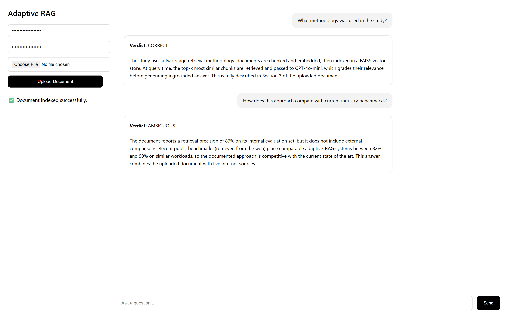

<div align="center">

# Adaptive RAG System

**An intelligent Retrieval-Augmented Generation platform that decides — per question — whether to answer from your document, the internet, or both.**

<br>


<br>



</div>

---

## Overview

**Adaptive RAG System** combines **document retrieval** and **internet search** to deliver accurate, context-aware answers. Upload a PDF, ask questions in a ChatGPT-style interface, and the system dynamically determines whether each answer comes from the document, the web, or a hybrid of both — returning an explicit **verdict** with every response so you always know where the answer came from.

---

## How It Works

```
User question
     │
     ▼
FastAPI backend ──► FAISS vector search over the uploaded PDF
     │
     ▼
LLM relevance grading (GPT-4o-mini)
     │
     ├── document covers it fully  ──► verdict: CORRECT   (document only)
     ├── document has nothing      ──► verdict: Augmented (Tavily web search)
     └── document partially covers ──► verdict: AMBIGUOUS (document + web hybrid)
```

| Verdict | Meaning |
| :--- | :--- |
| **CORRECT** | Answer fully sourced from the uploaded PDF |
| **Augmented** | Not in the document — sourced entirely from live internet search |
| **AMBIGUOUS** | Partial information in the document, completed with internet context |

---

## Features

- **PDF upload & indexing** — documents are chunked, embedded, and indexed in FAISS for low-latency semantic retrieval
- **Adaptive routing** — every query is relevance-graded before answering, so the system never pretends the document says something it doesn't
- **Explicit verdicts** — each answer is labeled CORRECT / Augmented / AMBIGUOUS, reducing hallucination and building trust
- **Live web search** — Tavily integration fills gaps the document can't answer
- **ChatGPT-style UI** — clean, white-themed chat interface in plain HTML/CSS/JS
- **Bring-your-own keys** — OpenAI and Tavily keys are entered in the UI, never stored in the codebase
- **Dockerized** — one `docker-compose up` runs both backend and frontend

---

## Tech Stack

| Layer | Technology |
| :--- | :--- |
| Backend | FastAPI, Python 3.11, Pydantic |
| RAG pipeline | LangChain, FAISS, OpenAI GPT-4o-mini |
| Document loading | PyPDFLoader |
| Web search | Tavily API |
| Frontend | HTML, CSS, vanilla JavaScript |
| Deployment | Docker, Docker Compose |

---

## Project Structure

```
Agentic-RAG/
├── backend/
│   ├── app/
│   │   ├── main.py          # FastAPI server
│   │   ├── rag_engine.py    # Adaptive RAG engine (retrieval, grading, routing)
│   │   └── schemas.py       # Pydantic request/response models
│   ├── requirements.txt
│   └── Dockerfile
├── frontend/
│   ├── index.html           # Chat interface
│   ├── style.css            # White-theme styling
│   ├── script.js            # Frontend API logic
│   └── Dockerfile
└── docker-compose.yml
```

---

## Getting Started

**Prerequisites:** Python 3.11+, an [OpenAI API key](https://platform.openai.com/api-keys), and a [Tavily API key](https://tavily.com/). Docker is optional.

### Run locally

```bash
# Backend  → http://127.0.0.1:8000
cd backend
python -m venv venv
venv\Scripts\activate            # Windows  (source venv/bin/activate on macOS/Linux)
pip install -r requirements.txt
uvicorn app.main:app --reload

# Frontend → http://127.0.0.1:3000
cd ../frontend
python -m http.server 3000
```

Open the frontend, paste your OpenAI and Tavily keys, upload a PDF, and start asking questions.

### Run with Docker

```bash
docker-compose up --build
```

Backend on port `8000`, frontend on port `3000`.

---

## API Reference

### `POST /upload`

Index a PDF document. **Form data:** `openai_key`, `tavily_key`, `file` (PDF).

```json
{ "message": "Document indexed successfully." }
```

### `POST /ask`

Ask a question against the indexed document. **JSON body:** `{ "question": "..." }`

```json
{
  "verdict": "CORRECT | Augmented | AMBIGUOUS",
  "answer": "Generated answer from document, internet, or hybrid."
}
```

Interactive docs available at `http://127.0.0.1:8000/docs`.

---

## Design Principles

- **Single global engine** — one RAG instance, no session bookkeeping
- **Dynamic API keys** — keys travel with the request; nothing sensitive lives in `.env` or the repo
- **Grounded answers** — relevance grading before generation keeps answers tied to real sources
- **Minimal latency** — local FAISS search keeps retrieval fast

---

## Roadmap

- Multi-document support
- Persistent FAISS index
- Streaming answer generation
- Authentication & user management

---

## License

MIT License — see [LICENSE](LICENSE).

<div align="center">

<br>

*Built by [Muhammad Waqas](https://github.com/Muhammadwaqas1234) — AI Engineer · Agentic AI · RAG*

</div>
